# [How Instagram Scaled Postgres to Billions of Users](https://www.youtube.com/watch?v=YLoYcwnqVzM) 🌟🌟🌟

Instagram runs one of the largest social graphs on the planet, and for the data that matters most — users, media metadata, comments, likes, the follow graph — it never left PostgreSQL. No exotic NewSQL database, no rewrite onto a distributed store. Just a relational database, pushed very hard, with a few carefully chosen layers of indirection around it.

That is the interesting part. The lesson is not "Postgres scales infinitely." It is that a boring, proven database plus the right _architecture_ around it will carry you further than most teams assume — and that the hard problems of scaling a database are rarely about the database itself. They are about identity, rebalancing, connections, and read amplification.

This article walks through the problem in the order Instagram actually hit it: first the ceiling of a single machine, then sharding, then the ID problem that sharding creates, then connections, then reads.

---

## The starting point: one server, three engineers

Early Instagram was deliberately unremarkable. Django on EC2, PostgreSQL for the primary data, Redis and Memcached for caching, S3 + CloudFront for photos. Three engineers took it to 14 million users.

Their stated engineering principles were:

- **Keep things very simple.**
- **Don't re-invent the wheel.**
- **Use proven, solid technologies when possible.**

These are not platitudes; they are the reason the rest of this story is possible. Every scaling decision below is the _least exotic_ option that solves the problem.

### Why a single Postgres instance eventually fails

A single database node has four distinct ceilings, and they arrive at different times:

1.  **Write throughput** — one primary accepts all writes. You cannot add more primaries without partitioning the data.
2.  **Storage** — the working set must fit on one machine's disks; more importantly, the _hot_ set should fit in RAM.
3.  **Memory / cache hit rate** — this is usually the real killer. As the table grows beyond RAM, index lookups start hitting disk, and latency degrades non-linearly. Performance does not slowly slope downward; it falls off a cliff the moment your hot index no longer fits in the buffer cache.
4.  **Connections** — each Postgres backend is a separate OS process costing real memory (roughly ~1.3 MB each for Instagram). A few thousand app threads will exhaust a server long before CPU does.

**The first move is always vertical.** Buy a bigger box. It is cheap, instant, and requires zero code change. Instagram did this — large memory-optimized instances — and you should too. Sharding is the nuclear option and it is irreversible in practice.

But vertical scaling ends. There is no bigger box.

### The order of escalation

Each step is cheap and reversible until the last one. Walk them in order.

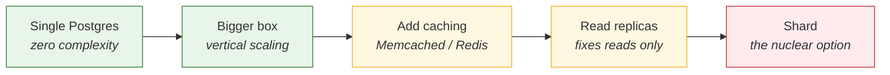

---

## Approach 1: Read replicas (the cheap horizontal win)

Before partitioning anything, you exhaust the easy axis: most social workloads are overwhelmingly read-heavy. A feed load is dozens of reads and zero writes.

- Run a **primary** that accepts all writes.
- Stream WAL to **N replicas** that serve reads.
- Spread replicas across availability zones for durability and failover.

Instagram ran a main cluster with a dozen replicas across zones, plus EBS snapshot backups.

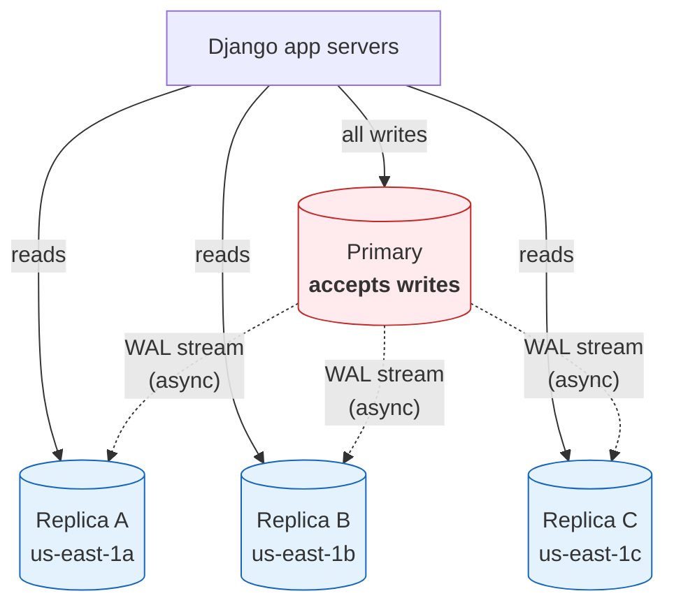

**What this fixes:** read throughput, read availability, and disaster recovery.

**What this does not fix:** writes and storage. Every replica holds a _full copy_ of the data and must apply _every_ write. You have multiplied your read capacity and multiplied your storage cost, while the write ceiling has not moved by a single transaction.

**The trap — replication lag.** Replicas are asynchronous. A user posts a photo (write → primary), the client immediately reloads the profile (read → replica), and the photo is not there yet. This is a _read-your-own-writes_ violation and it looks like a data-loss bug to the user.

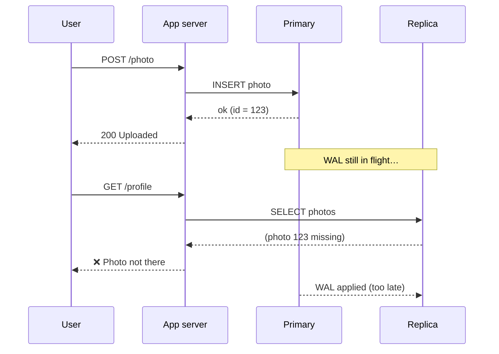

The standard fixes:

- Route reads to the primary for a short window after a user's write (sticky reads).
- Or optimistically render the write client-side without waiting for the round trip.

**TC of a feed read:** unchanged, but spread across N machines.
**SC:** N× the data, since every replica is a full copy.

---

## Approach 2: Sharding — and the rebalancing problem

Eventually writes and storage force the issue. You must partition the data so each machine owns only a slice of it.

The naive version: pick a shard key (say `user_id`), and route with

```
physical_server = hash(user_id) % NUM_SERVERS
```

This works beautifully until the day you add a server. `NUM_SERVERS` changes from 8 to 9, the modulus changes for _almost every row in the database_, and now you must physically relocate nearly all your data while staying online. This is the **rebalancing problem**, and it is the single reason naive sharding is a trap.

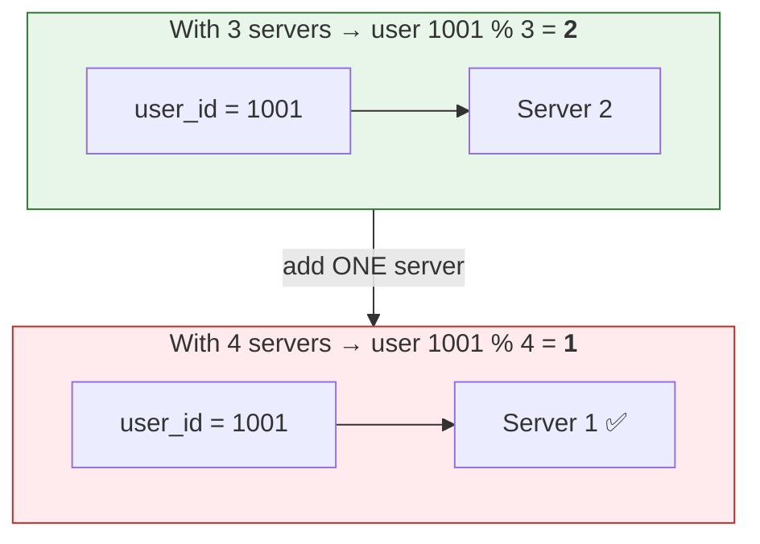

The row did not change. The server that owns it did — and the same is true for _almost every other row_. Adding one machine means moving nearly the entire dataset.

Consistent hashing is one well-known answer. Instagram chose something simpler and, for a relational database, far more elegant.

### The key idea: logical shards decoupled from physical shards

Instead of mapping users directly to _servers_, Instagram introduced a layer of indirection:

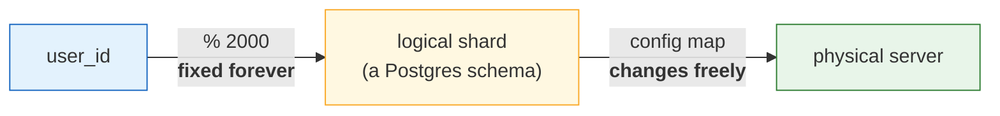

The left arrow is frozen for life; the right arrow is just a config entry you can rewrite whenever you add hardware. That split is the entire design.

- Pick a large, **fixed** number of logical shards up front — a few thousand (Instagram used several thousand; the canonical write-up uses 2000, and the ID format reserves room for 8192).
- That number **never changes**, so `user_id % NUM_LOGICAL_SHARDS` never changes, so a row's logical shard is stable for life.
- A **config map** in application code says which physical server currently hosts which logical shards.

Adding capacity is now: move some logical shards to the new server, update the map. No re-bucketing, no recomputed hashes, no application logic change.

### The trick: a logical shard is just a Postgres schema

This is the part worth internalizing, because it is where "use proven technology" pays off. A logical shard is not a separate process, port, or cluster. It is a **PostgreSQL schema** — a plain namespace inside a database, a native feature since forever.

```sql
-- Each logical shard is a schema; each holds the same table structure.
CREATE SCHEMA insta5;
CREATE TABLE insta5.photos (...);

CREATE SCHEMA insta6;
CREATE TABLE insta6.photos (...);
```

On day one, all several thousand schemas can live on **one physical server**. The application already addresses them as if they were separate shards, so the code is "sharded" long before the hardware is.

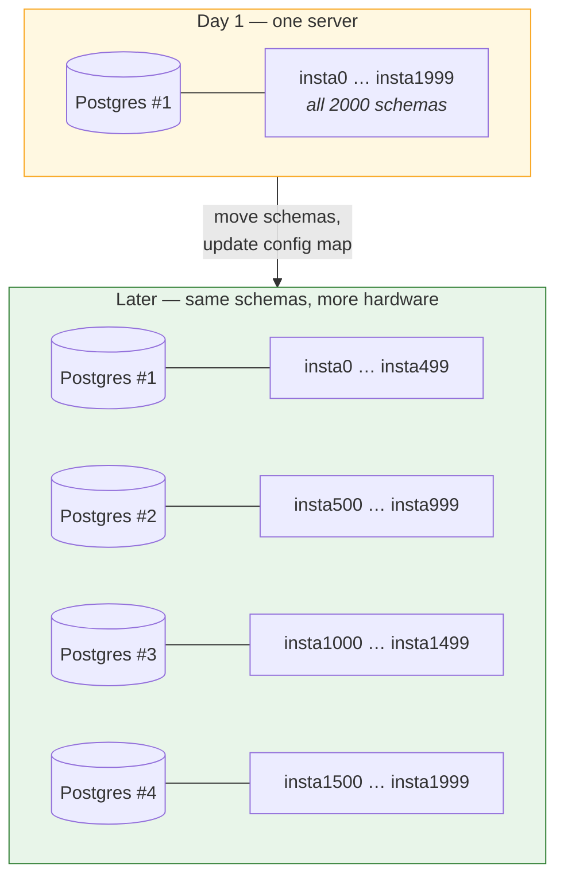

**No row ever changes its logical shard.** Only the schema&rarr;server mapping moves.

Migration of a logical shard is then a boring, well-trodden operation:

1.  `pg_dump` the schema from the source server.
2.  Restore it on the destination server.
3.  Update the config map to point that logical shard at its new home.
4.  Delete the old copy.

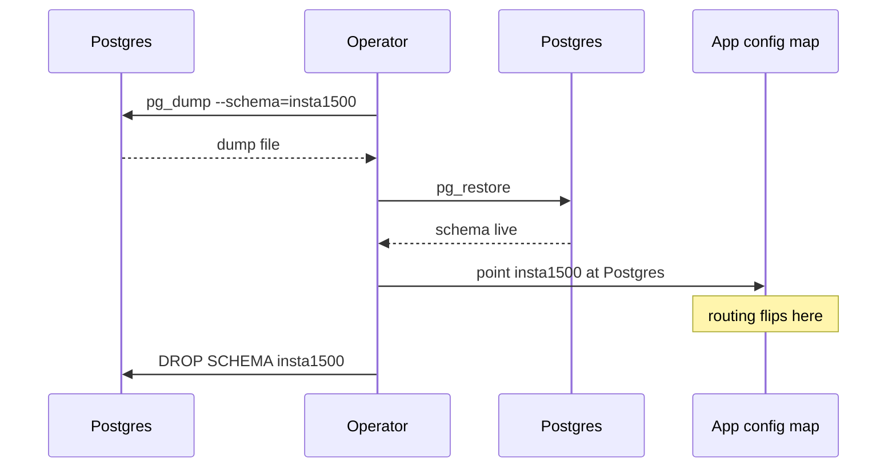

No custom tooling, no bespoke data-movement service. Standard Postgres backup and restore.

> **Why this is the whole ballgame:** the expensive, risky operation in any sharded system is moving data. By making the unit of movement a schema — small, self-contained, and dumpable with stock tooling — Instagram turned "re-shard the database" from a multi-quarter project into a routine operational task.

### The cost of sharding — what you give up

Sharding is not free, and anyone proposing it should be able to recite this list:

- **No cross-shard joins.** Data for different users lives on different machines. Joins that used to be one SQL statement become N queries plus application-side assembly.
- **No cross-shard transactions.** ACID guarantees stop at the boundary of a single Postgres instance.
- **Global secondary lookups get hard.** "Find user by email" has no `user_id` to route on, so it either fans out to every shard or needs a separate lookup table.
- **Hot shards.** A celebrity account can make one shard far busier than its neighbours. Modulus hashing spreads _count_ evenly, not _load_.
- **Every query needs a routing key.** The shard key must be available at the call site, which constrains API design permanently.

This is why the honest advice is: **do not shard until a bigger box and read replicas have genuinely run out.** For most products, they never do.

---

## Approach 3: IDs in a sharded world

Sharding quietly breaks something fundamental: `AUTO_INCREMENT` / `SERIAL`.

A sequence is only unique within one Postgres instance. Shard 1 and shard 2 will both happily hand out `id = 42`. You now need IDs that are globally unique across thousands of shards.

Instagram's requirements:

1.  **Globally unique**, obviously.
2.  **Roughly time-sortable** — feeds are ordered by recency, and if IDs sort by time you can order by primary key and skip a secondary index entirely.
3.  **64 bits** — IDs appear in indexes, foreign keys, and caches billions of times over. A 128-bit UUID doubles the size of every index that references it.
4.  **No new moving parts.** They explicitly did not want to operate a separate ID service.

### Options considered

| Approach                                          | Verdict                                                                                                                                                          |
| :------------------------------------------------ | :--------------------------------------------------------------------------------------------------------------------------------------------------------------- |
| **UUID v4**                                       | Unique and coordination-free, but 128 bits and **random**. Random IDs destroy B-tree locality — inserts scatter across the index, and there is no time ordering. |
| **Dedicated ID service** (e.g. Twitter Snowflake) | Conceptually right, but adds a service to deploy, monitor, and keep highly available. It is now on the critical path of every single write.                      |
| **Snowflake's idea, inside Postgres**             | ✅ Chosen. Same bit-packing concept, but generated by the database that is already in the write path.                                                            |

### The 64-bit layout

```
 ┌──────────────────────────────┬──────────────┬───────────┐
 │  41 bits: ms since epoch     │ 13 bits:     │ 10 bits:  │
 │                              │ logical shard│ sequence  │
 └──────────────────────────────┴──────────────┴───────────┘
  63                         23   22        10   9        0
```

- **41 bits — timestamp in milliseconds**, relative to a _custom_ epoch rather than 1970. Starting the clock at company founding buys back all the years Unix already burned: 2⁴¹ ms ≈ **41 years** of IDs.
- **13 bits — logical shard ID**, which is `user_id % NUM_LOGICAL_SHARDS`. 2¹³ = **8192** possible shards. Note what this does: _the ID carries its own routing information._ Given any ID, you can compute which shard holds it with a bit shift — no lookup table, no round trip.
- **10 bits — a per-shard sequence**, taken `mod 1024`. This disambiguates IDs created in the same millisecond on the same shard: **1024 IDs per shard per millisecond**, ≈ 1M IDs/sec/shard.

Because the timestamp occupies the high bits, **numeric sort order equals chronological order**. Sorting a feed by `id DESC` is sorting by time, using the primary key index that already exists.

How the three pieces get packed into one 64-bit integer:

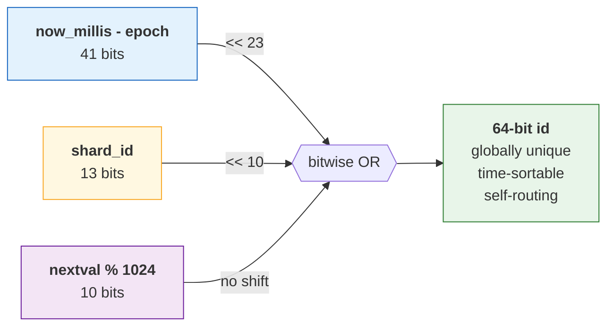

And the payoff — reading the route straight back out of the ID, with no lookup:

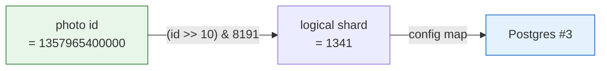

### The implementation

The generator is a PL/pgSQL function, installed once per schema, wired in as a column default:

```sql
CREATE OR REPLACE FUNCTION insta5.next_id(OUT result bigint) AS $$
DECLARE
    our_epoch bigint := 1314220021721;  -- custom epoch, not 1970
    seq_id bigint;
    now_millis bigint;
    shard_id int := 5;                  -- this schema's logical shard
BEGIN
    SELECT nextval('insta5.table_id_seq') % 1024 INTO seq_id;

    SELECT FLOOR(EXTRACT(EPOCH FROM clock_timestamp()) * 1000) INTO now_millis;

    result := (now_millis - our_epoch) << 23;   -- 13 + 10 = 23 bits to the right
    result := result | (shard_id << 10);
    result := result | (seq_id);
END;
$$ LANGUAGE PLPGSQL;
```

```sql
CREATE TABLE insta5.our_table (
    id   bigint NOT NULL DEFAULT insta5.next_id(),
    ...
) WITH (OIDS=FALSE);
```

The application never generates an ID. It inserts, and uses `INSERT ... RETURNING id` to get the value back in the same round trip.

**Why this is the lazy-but-correct solution:** the ID is produced by a database that is _already_ being contacted for the write. Zero additional network hops, zero additional services, zero additional failure modes. Snowflake's benefits without Snowflake's operational surface.

**The failure mode to know:** exceed 1024 IDs in one millisecond on one shard and the sequence wraps, colliding with an ID already issued that millisecond. Since `id` is the primary key, the insert fails loudly rather than silently corrupting — which is the right way to fail, but it is a real ceiling.

---

## Approach 4: Connection pooling with PGBouncer

Sharding and replicas multiply your _database_ capacity, and in doing so expose a bottleneck that has nothing to do with data volume.

PostgreSQL uses a **process-per-connection** model. Every connection forks a backend process costing on the order of **1.3 MB**. Do the arithmetic: 25+ stateless app servers × dozens of workers each × a connection per worker = thousands of connections. At ~1.3 MB apiece that is gigabytes of RAM spent on connection bookkeeping, plus context-switching overhead, before a single query runs.

The fix is a **connection pooler** sitting between the application and the database:

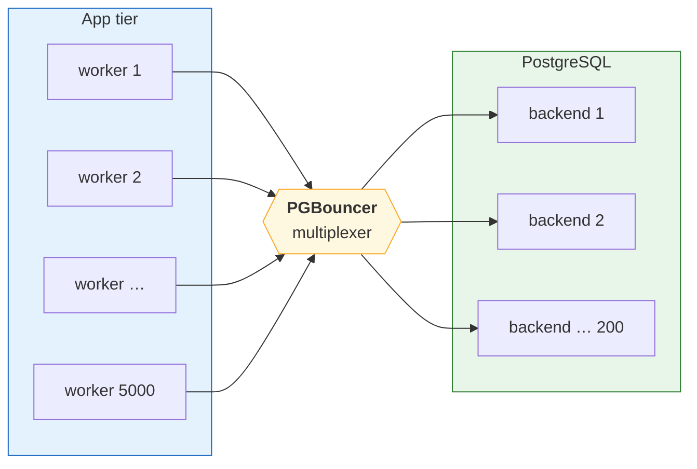

5000 cheap client connections collapse onto ~200 real backends — at ~1.3 MB each, that is ~6.5 GB of RAM saved before a single query runs.

**PGBouncer** is a tiny, single-process, event-driven proxy. Clients connect to it cheaply; it multiplexes them onto a small pool of real Postgres connections. Because most connections are idle between queries, a few hundred real backends comfortably serve thousands of clients.

Its pooling modes matter:

- **Session pooling** — a client holds its backend until it disconnects. Safest, least efficient.
- **Transaction pooling** — a backend is assigned only for the duration of a transaction, then returned. This is the high-multiplexing mode, and the one that gives the large win. The catch: anything relying on session state (prepared statements, `SET` variables, advisory locks, `LISTEN/NOTIFY`) breaks, because your next transaction may land on a different backend.

**TC:** unchanged per query — the pooler adds a negligible hop.
**SC:** connection memory drops from O(app workers) to O(pool size), typically a 10× reduction.

---

## Approach 5: Caching — keeping reads off the database entirely

The cheapest query is the one you never send.

- **Memcached** sat in front of Django as a general-purpose object cache — rendered objects, hot rows, session data.
- **Redis** held data structures that Postgres is a poor fit for, most notably a **photo ID → user ID** mapping. Roughly 300 million such mappings fit in under 5 GB through careful hashing (storing them in hashes with small `ziplist`/`listpack` encodings rather than as millions of top-level keys, which collapses per-key overhead).

That Redis map is doing real architectural work. Given a photo ID, it yields the user ID, and the user ID yields the shard. It is the **global secondary index** that sharding otherwise takes away from you.

Instagram also ran Redis in a primary-replica configuration with snapshot backups — the cache layer is load-bearing, so it needs its own availability story.

---

## Putting it together

The request path for loading a photo, end to end:

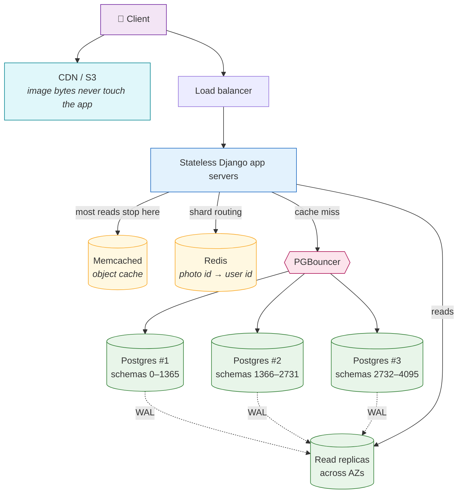

Following a single "load this photo" request all the way down:

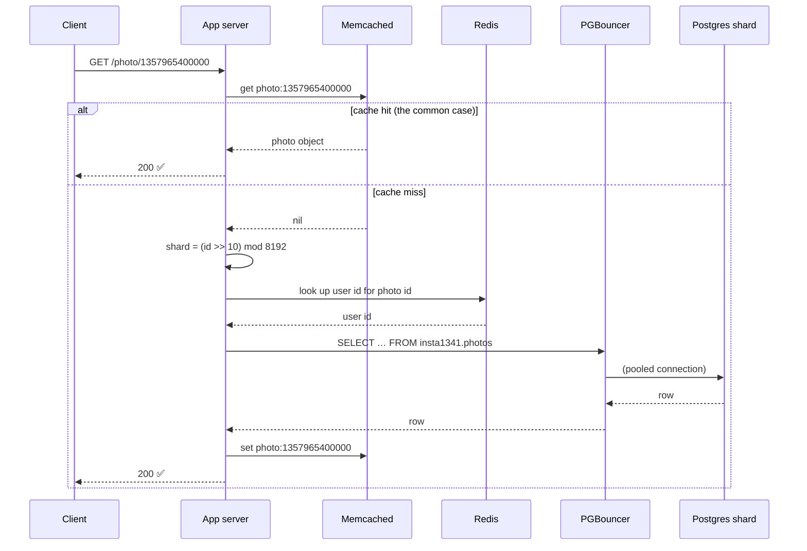

Every layer exists to answer one specific failure of the layer below it:

| Problem                         | Layer that solves it                     |
| :------------------------------ | :--------------------------------------- |
| Too many reads                  | Memcached, then read replicas            |
| Too many writes / too much data | Sharding by logical shard                |
| Rebalancing when adding servers | Logical shards as Postgres schemas       |
| IDs unique across shards        | 64-bit time-sortable ID, generated in-DB |
| Too many connections            | PGBouncer transaction pooling            |
| Routing without a shard key     | Redis ID → user mapping                  |

---

## Takeaways for an interview

1.  **Scale in order, and say so.** Vertical scale → caching → read replicas → sharding. Jumping straight to sharding in a design interview signals that you have not priced its cost.
2.  **The hard part of sharding is rebalancing, not partitioning.** Anyone can write `hash(key) % N`. The senior answer explains what happens when `N` changes.
3.  **Indirection is the tool.** Logical shards decouple the stable thing (a row's identity) from the mobile thing (which server holds it). Same pattern as consistent hashing, virtual nodes, or Vitess keyspaces.
4.  **Sharding breaks IDs.** If you propose sharding, be ready to explain ID generation immediately — it is the standard follow-up.
5.  **Time-sortable IDs pay a dividend.** Sorting by primary key replaces a `created_at` index, and encoding the shard in the ID removes a lookup.
6.  **Connection count is a real, separate bottleneck** with Postgres's process-per-connection model, and it surprises people. Naming PGBouncer is a strong signal.
7.  **Boring technology wins.** Postgres schemas, `pg_dump`, a PL/pgSQL function, an off-the-shelf pooler. Nothing here was invented; it was _composed_.

---

## References

- [Sharding & IDs at Instagram](https://instagram-engineering.com/sharding-ids-at-instagram-1cf5a71e5a5c) — Instagram Engineering (primary source for the sharding scheme and ID format)
- [What Powers Instagram: Hundreds of Instances, Dozens of Technologies](https://instagram-engineering.com/what-powers-instagram-hundreds-of-instances-dozens-of-technologies-adf2e22da2ad) — Instagram Engineering
- [How Instagram scaled to 14 million users with only 3 engineers](https://read.engineerscodex.com/p/how-instagram-scaled-to-14-million) — Engineer's Codex
- [PGBouncer documentation](https://www.pgbouncer.org/features.html)
- Video: [How Instagram Scaled Postgres to 2 Billion Users](https://www.youtube.com/watch?v=YLoYcwnqVzM)

> **A note on the numbers:** the primary engineering write-ups above date from Instagram's 2011–2012 era. The logical-sharding pattern, the ID scheme, and the pooling strategy are the durable lessons and remain the canonical reference for this problem; the specific instance counts and data sizes describe a much smaller system than Instagram runs under Meta today.
