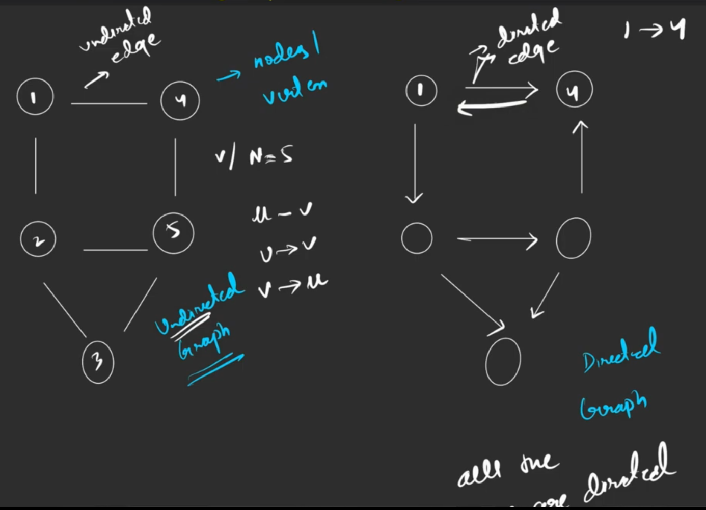

# Introduction to Graph

### Type of graphs

1. **Directed:** If there is an edge from u to v, then there is no edge from v to u.

2. **Undirected:** If there is an edge from u to v, then there is an edge from v to u.

### Components of a Graph

-   **Vertices/Nodes (N):** Vertices are the fundamental units of the graph. Sometimes, vertices are also known as vertex or nodes. Every node/vertex can be labeled or unlabelled.

-   **Edges (E):** Edges are drawn or used to connect two nodes of the graph. It can be ordered pair of nodes in a directed graph. Edges can connect any two nodes in any possible way. There are no rules. Sometimes, edges are also known as arcs. Every edge can be labeled/unlabelled.

-   **Path**: Contains a lot of nodes and each of them are reachable. A node cannot appear twice in path.

-   **Degree in undirected graph**: Number of edges connected to a node.

    -   **No of total degree in undirected graph: 2 \* E**, Because each edge is counted twice.

-   **Degree in directed graph**:

    -   **In-degree**: Number of edges coming into a node.
    -   **Out-degree**: Number of edges going out of a node.

-   **Edge weight**: Weight of an edge is the value associated with it. It can be used to represent the cost of the edge. By default we can assume weight of an edge as 1. 
