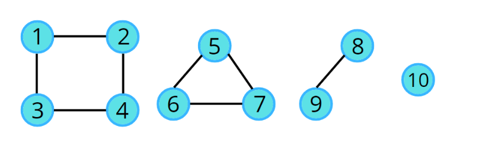

# Connected Components



Sometimes graph is represented in number of pieces, we called them as connected components. They all are the parts of the graph.

To travel these connected components we use visited array. We fill the array with 0 and as we traverse the graph we mark the visited nodes as 1.

```cpp
for(int i=0;i<n;i++){
    if(!visited[i]){
        traversal(i);
    }
}
```
